<!-- Terminal-themed profile. Every animation is an SVG that lives in this repo (assets/ on main, generated cards on the output branch) — no third-party stats services to go down. -->

  

  
  
  
  
  

## `$ neofetch`

  
   
  

## `$ cat about.md`

- **Now** — Building the core of a protein-design agent platform for AI drug discovery: the `deepagents / LangGraph` runtime, RAG with source citations, a visual workflow engine, MCP tool integration, an agent code sandbox, observability, and **resumable multi-session streaming** — close the tab and the task keeps running; come back and the missed events replay.
- **Before** — Nine years of full-stack work, the first seven going deep on the front end: mini-program core flows serving tens of millions of users, a home-grown error-logging SDK plus a Lark bot for log triage, a low-code campaign platform (287 pages shipped to production), a macOS build tool in SwiftUI, and Electron debugging tools.
- **Credo** — Turn repetitive work into systems; it's a habit, and a joy. The engineering between demo and product — parameter contracts, reconnection, idempotency, recoverability — is where I'm most at home.

## `$ ls stack/`

  
   
  
    
  
  
  
  
  
  
  
  
  

## `$ ls -la projects/`

<table align="center">
  <tr>
    <td width="33%" valign="top">
      <a href="https://github.com/mx94/omni-log"><b>omni-log</b></a> 
      Cross-platform logging &amp; analytics SDK for mini-programs and the web: zero-intrusion auto-capture of lifecycle, HTTP, JS errors and web vitals, with unified reporting. Published on npm.  
      
      
    </td>
    <td width="33%" valign="top">
      <a href="https://github.com/mx94/turbo-support-platform"><b>turbo-support-platform</b></a> 
      Full-stack helpdesk &amp; ticketing on Turborepo + Next.js + Supabase: row-level security, realtime WebSocket chat, an AI assistant with human takeover. Live demo included.  
      
      
    </td>
    <td width="33%" valign="top">
      <a href="https://github.com/mx94/uniapp-subpackage-async-loader"><b>uniapp-subpackage-async-loader</b></a> 
      Async sub-package compilation for uni-app (Vue 2) mini-programs: a Webpack loader plus Babel AST transforms patch the core build so cross-package components are declared once and wired automatically.  
      
      
    </td>
  </tr>
  <tr>
    <td width="33%" valign="top">
      <a href="https://github.com/mx94/MiniBuild"><b>MiniBuild</b></a> 
      macOS app for building, packaging and sharing mini-programs: moves a dozen cross-framework, cross-Node-version builds onto local machines to skip the release queue.  
      
      
    </td>
    <td width="33%" valign="top">
      <a href="https://github.com/clouDr-f2e/rubick-plugin-monalisa"><b>rubick-plugin-monalisa</b></a> 
      Design-to-UI visual regression plugin for the Rubick ecosystem: puppeteer screenshots + blink-diff pixel comparison, scored against the mockup. Built at clouDr; the original repo has 20★.  
      
      
    </td>
    <td width="33%" valign="top">
      <a href="https://github.com/mx94/integration-service"><b>integration-service</b></a> 
      Unified third-party integration service, routed by provider (Coze / Dify / Lark / GitHub) × capability; currently carrying the voice-control path for a Hermes Agent.  
      
      
    </td>
  </tr>
  <tr>
    <td width="33%" valign="top">
      <a href="https://github.com/mx94/eznumber"><b>eznumber</b></a> 
      Expression-driven number formatting: <code>'123.989 | >=2'</code> declares precision and rounding direction in one string, and scientific notation expands automatically.  
      
      
    </td>
    <td width="33%" valign="top">
      <a href="https://github.com/mx94/diff-image"><b>diff-image</b></a> 
      Image-similarity playground with screen capture: SSIM, cosine similarity, mutual information, Pillow histograms and OpenCV difference marking, side by side.  
      
      
      
    </td>
    <td width="33%" valign="top">
      <a href="https://github.com/mx94/api-previewer"><b>api-previewer</b></a> 
      Turns an OpenAPI 3.x JSON file into a static Swagger UI site you can deploy to GitHub Pages — instant, browsable API docs for services without a docs portal.  
      
      
    </td>
  </tr>
</table>

## `$ tail -f contributions.log`

  <picture>
    <source media="(prefers-color-scheme: dark)" srcset="https://raw.githubusercontent.com/mx94/mx94/output/github-contribution-grid-snake-dark.svg">
    <source media="(prefers-color-scheme: light)" srcset="https://raw.githubusercontent.com/mx94/mx94/output/github-contribution-grid-snake.svg">
    
  </picture>

## `$ ping curry`

  
  

 

  <code>curry@mx94 ~ % exit</code> &nbsp;·&nbsp; <code>[Process completed]</code>

